# Klack

## Description
Klack project attempts to build a full stack clone of the Slack application, including database, file storage, RESTful API, web framework, and UI design.

[Live Link](https://klack.onrender.com)

## Features
* Credential authentication
* Server error handling
* Client form validation
* Image croping and uploading with AWS
* Realtime messaging and state synchronization with Socket.IO
* New invitation and message notifications
* Rich text editor featuring formatting, mention, and emoji picker with CKEditor5
* Chat box featuring auto focusing and infinite scrolling
* Workspace, channel, invitation, message, and reply creation, updating, and deletion

## Tools
* React
* Redux
* Flask
* SqlAlchemy
* Alembic
* Sqlite3
* PostgreSQL
* CSS
* HTML
* CKEditor5
* emoji-picker-react
* html-react-parser
* react-avatar-editor
* react-spring
* Socket.IO

## Project Showcasing
1. Create Workspace
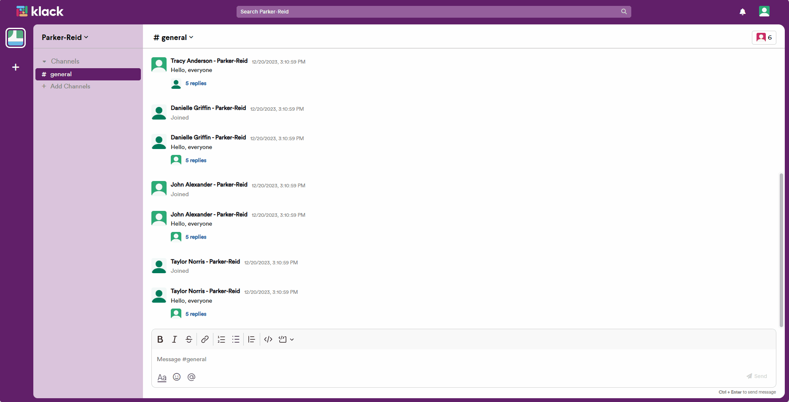
2. Edit Workspace
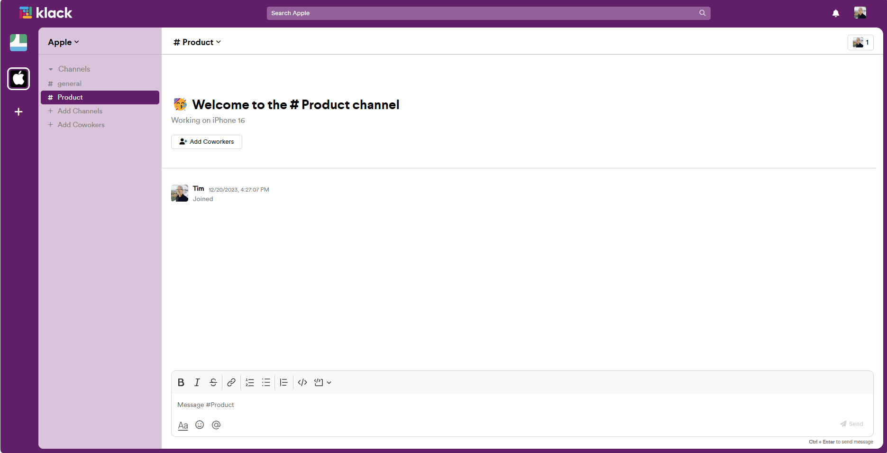
3. Leave Workspace
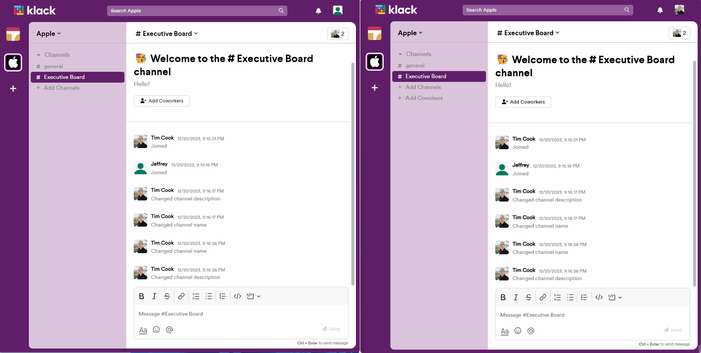
4. Delete Workspace
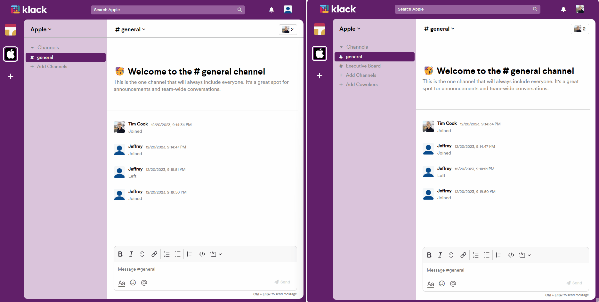
5. Send and Accept Invitation
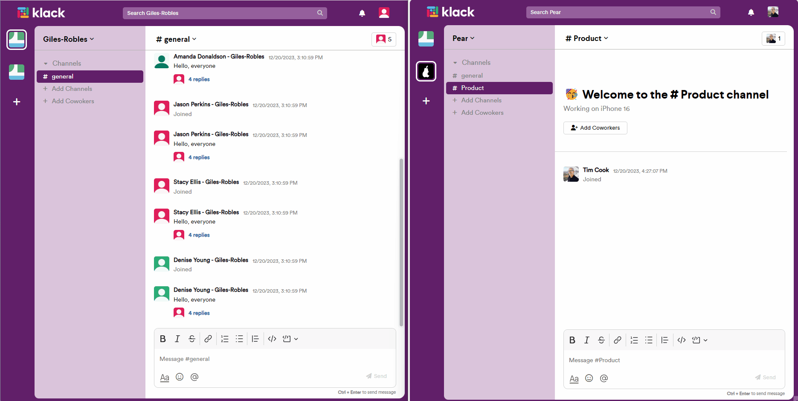
6. Add Coworkers to Channel
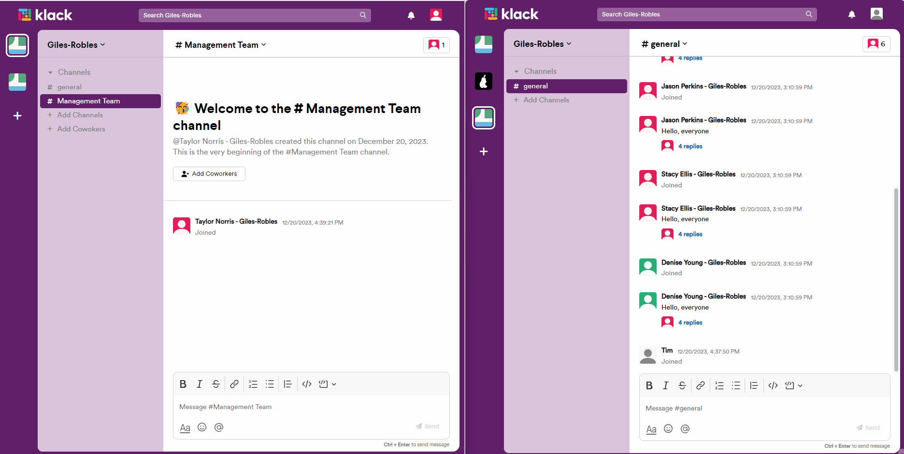
7. Create Channel
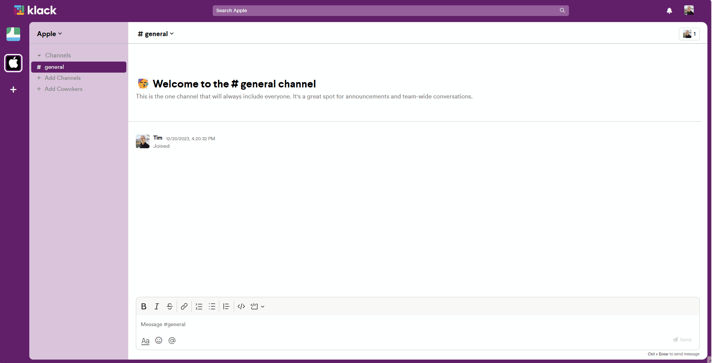
8. Edit Channel
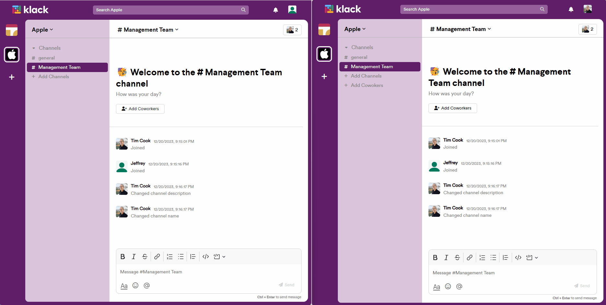
9. Leave Channel

10. Delete Channel
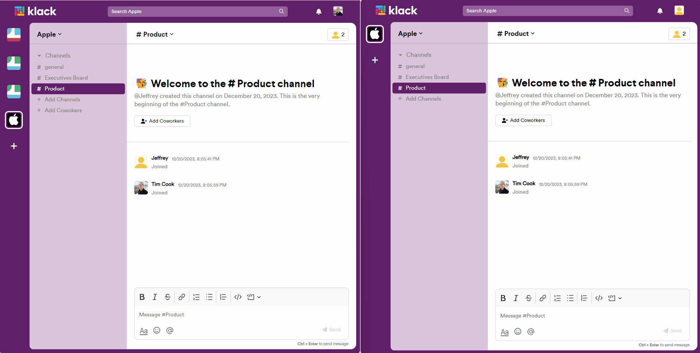
11. Channel Details
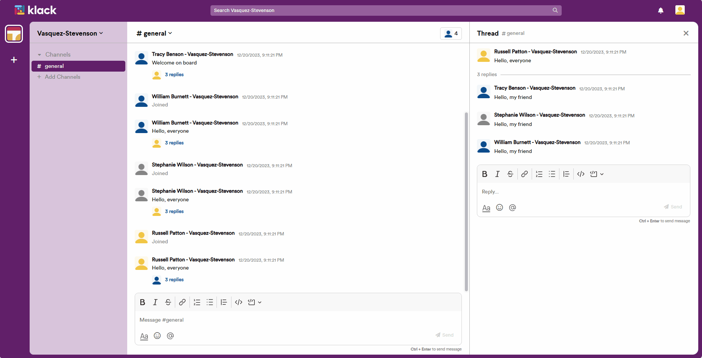
12. Edit Profile
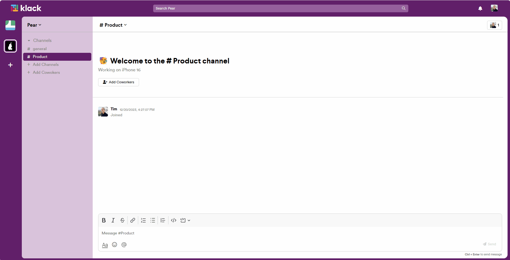
13. Send, Edit, and Delete Channel Message
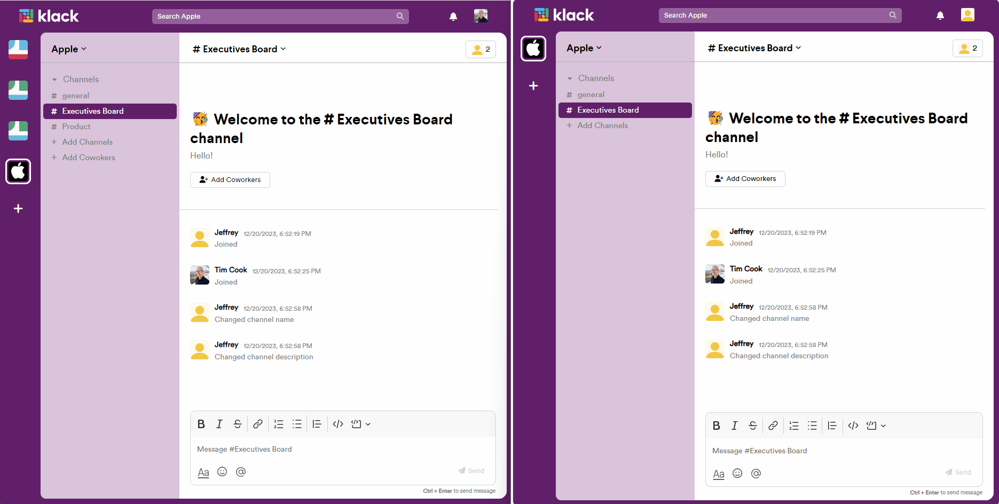
14. Send, Edit, and Delete Message Reply
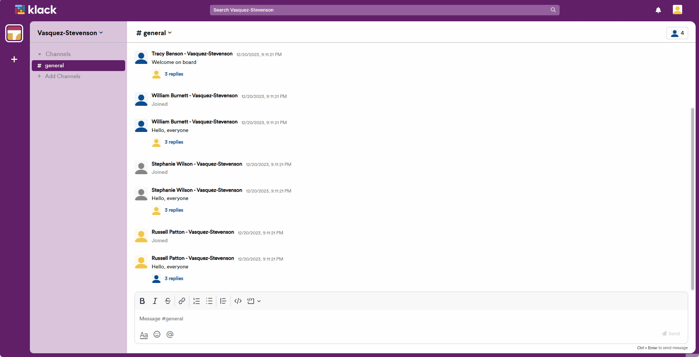

## Setup
1. Clone project
```
git clone https://github.com/Jeffrey940421/klack.git
```
2. Set up .env file in root folder
```
SECRET_KEY=<YOUR SECRETE KEY>
DATABASE_URL=sqlite:///dev.db
SCHEMA=klack_schema
S3_BUCKET=<YOUR S3 BUCKET NAME>
S3_KEY=<YOUR S3 BUCKET KEY>
S3_SECRET=<YOUR S3 BUCKET SECRET>
```
3. Install packages in root folder
```
pipenv install
```
4. Run migrations and seeds
```
pipenv run flask db upgrade
pipenv run flask seed all
```
5. Start the server
```
pipenv run flask run
```
5. Install packages in fontend folder
```
cd react-app
npm install
```
6. Open a new terminal and start the app in fontend folder
```
npm start
```
